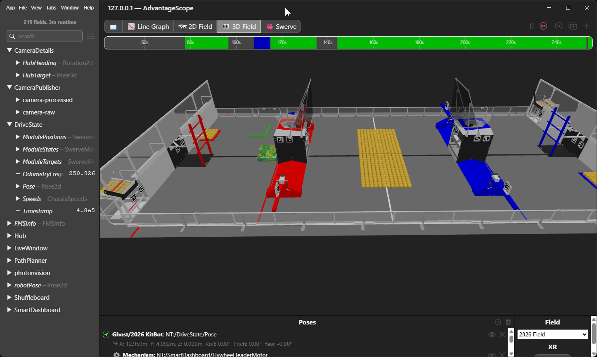
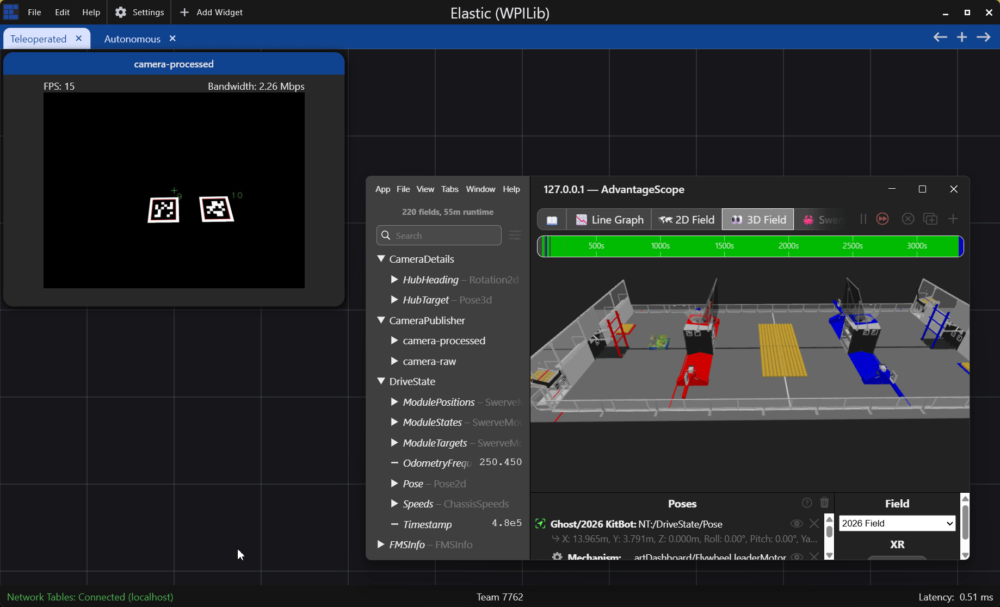

# 2026 Rebuilt Example Code

Welcome to the 2026 Rebuilt Example Code. The goal of this repository is to explore how a minimally adapted kitbot robot could be programmed using the Phoenix software suite and commandbased best practices. This robot builds on top of the CTR Electronics [SwerveWithPathPlanner](https://github.com/CrossTheRoadElec/Phoenix6-Examples/tree/main/java/SwerveWithPathPlanner) example base and implements the following features.

- Generated swerve code with [Phoenix Tuner X](https://v6.docs.ctr-electronics.com/en/stable/docs/tuner/index.html).
- Generated intake and flywheel code with Phoenix Tuner X (coming soon).
- Robot localization using April Tags (note that these should be adjusted to your individual camera setup).
- [Hoot replay](https://v6.docs.ctr-electronics.com/en/stable/docs/api-reference/api-usage/hoot-replay.html) for log playback.
- Mechanism2D implementations for the flywheel and intake.



## Usage

While the primary goal of this repository is to provide an example of how to implement the kitbot mechanisms on a swerve chassis, integration is quite easy. These instructions assume the user has updated their [device firmware](https://v6.docs.ctr-electronics.com/en/stable/docs/tuner/device-details-page.html#field-upgrade-firmware-version), installed the latest [2026 of FRC game tools](https://docs.wpilib.org/en/stable/docs/zero-to-robot/step-2/frc-game-tools.html), and [imaged their roboRIO](https://docs.wpilib.org/en/stable/docs/zero-to-robot/step-3/roborio2-imaging.html) to 2026. Additionally, this project assumes the user is utilizing Kraken X60 motors on mechanisms that would otherwise use a CIM + Spark Max. General kitbot code for CIM + Spark Max can be found on the [FIRST resource site](https://www.firstinspires.org/resources/library/frc/kitbot).

Constants for each subsystem motors are stored in each subsystem. There are three core subsystems that you need to adapt for your configuration:

* Swerve - Replace the `TunerConstants.java` in this project with one generated by Tuner X specific to your robot.
* Flywheel - Single motor, tuned for the kitbot flywheel. If you have modified the kitbot flywheel, you may need to adjust the gain constants for your robot. Otherwise, you just need to modify the device ID.
* Intake - Single motor, tuned for the kitbot intake and indexer. If you have modified the kitbot intake/indexer, you may need to adjust the gain constants for your robot. Otherwise, you just need to modify the device ID.

The three subsystems compose the primary functionality on the kitbot. This example expands upon the initial kitbot by integrating vision localization and a basic autonomous pipeline.

## RobotContainer Plumbing

`RobotContainer.java` begins with initializing our subsystems and utility classes. This is mostly identical to the SwerveWithPathPlanner project, apart from SysID has been removed (to clean up the project a bit) and with the new subsystem and utility classes.

Named commands, which are necessary for PathPlanner autonomous routines, are initialized in the constructor. Notice that the commands are not defined in explicit command java files. The FRC software ecosystem has moved to inline commands. Commands that are constructed by daisy-chaining using the command decorators provided by WPILib.

```java
NamedCommands.registerCommand("Stop Shooting", flywheel.coastFlywheel().alongWith(intake.coastIntake()));
/* Shoot commands need a bit of time to spool up the flywheel before feeding with the intake */
NamedCommands.registerCommand("Shoot Near", flywheel.setTarget(() -> FlywheelSetpoint.Near)
                                                    .alongWith(Commands.waitUntil(isFlywheelReadyToShoot).andThen(intake.setTarget(() ->IntakeSetpoint.FeedToShoot))));
NamedCommands.registerCommand("Shoot Far", flywheel.setTarget(() -> FlywheelSetpoint.Far)
                                                    .alongWith(Commands.waitUntil(isFlywheelReadyToShoot).andThen(intake.setTarget(() ->IntakeSetpoint.FeedToShoot))));
NamedCommands.registerCommand("Stop Intake", intake.coastIntake().alongWith(flywheel.coastFlywheel()));
NamedCommands.registerCommand("Intake Fuel", intake.setTarget(() -> IntakeSetpoint.Intake).alongWith(flywheel.setTarget(()-> FlywheelSetpoint.Intake)));
NamedCommands.registerCommand("Outtake Fuel", intake.setTarget(() -> IntakeSetpoint.Outtake).alongWith(flywheel.setTarget(()-> FlywheelSetpoint.Outtake)));

autoChooser = AutoBuilder.buildAutoChooser("Only Score");
SmartDashboard.putData("Auto Mode", autoChooser);

configureBindings();

// Warmup PathPlanner to avoid Java pauses
CommandScheduler.getInstance().schedule(FollowPathCommand.warmupCommand());
```

The rest of `RobotContainer` is just plumbing what the various buttons on the joystick do. For convenience, they are listed here (assuming Xbox gamepad).

- `Left Y` - Forward and Backwards Translation (remember field oriented).
- `Left X` - Left and Right Translation (remember field oriented).
- `Right X` - Rotational Velocity or Rotational "power".
- `A button` - Lock the modules into an X and apply a braking force.
- `B button` - Allow user translation but orient robot toward to hub.
- `D-pad povUp` - Drive forward in a straight line.
- `D-pad povDown`- Drive backwards in a straight line.
- `Start button` - Re-seed our pose (pressing this would make it so the current orientation is "forwards"). 
- `Left Bumper` - Intake **FUEL**.
- `Left Trigger` - Eject **FUEL** (in case there is a jam).
- `Right Bumper` - Spin the flywheel up to speed and begin shooting for our `NEAR` position.
- `Right Trigger` - Spin the flywheel up to sped and begin shooting for our `FAR` position.

## Vision Integration

Vision samples are provided by [PhotonVision](https://photonvision.org/), a free to use, community developed vision solution that runs on Linux hardware.

A utility class called `PhotonVisionSystem` runs a `periodic` routine (this is a utility class instead of a subsystem, as it doesn't implement any commands or functionality that necessitates it being a subsystem) that integrates PhotonVision pose estimates into odometry and provides a few utility features.

First, we grab the relevant `hubTargetIds` as this is what we localize our robot against. These change depending on what alliance the robot is on.

```java
/* If this is not replay, get the hardware/simulated results from the camera */
var allResults = targetCamera.getAllUnreadResults();
var estimates = new ArrayList<LoggableRobotPose>();

int[] hubTargetIds;
/* Figure out if we should use red alliance hub ids or blue alliance hub ids */
if (currentAlliance == Alliance.Red) {
    hubTargetIds = RedHubApriltagIds;
} else {
    hubTargetIds = BlueHubApriltagIds;
}
```

Then, we start processing through all our vision results (`allResults`). We iterate through all of the targets identified in a sample and find the best target based on an error metric PhotonVision provides called `poseAmbiguity`.

```java
var allTargets = result.getTargets();
/* Pick the target with the lowest ambiguity */
PhotonTrackedTarget bestTarget = null;
for (PhotonTrackedTarget target : allTargets) {
    /* Check that the apriltag id is a hub ID */
    if (Arrays.stream(hubTargetIds).anyMatch(x -> x == target.fiducialId)) {
        /* If we've never assigned the best target, use this one */
        if (bestTarget == null) {
            bestTarget = target;
        }
        /* Otherwise only update the target if this is a better ambiguity */
        else if (target.poseAmbiguity < bestTarget.poseAmbiguity && target.poseAmbiguity > 0) {
            bestTarget = target;
        }
    }
}
```

Then we use the target pose information to update some information that could be useful for alignment and logging. The important pieces here is that we save and log `hubTarget` and `hubHeading`. `hubTarget` is the 3D position of the detected hub `AprilTag`. `hubHeading` is the `heading` of the tag relative to the robot. The `hubHeading` is used to orient the robot when we are running the flywheel.

```java
/* And if we have a best target, use it */
if (bestTarget != null) {
    lastTrackedHubTarget = bestTarget;
    timeOfLastTrackedHubTarget = Utils.getCurrentTimeSeconds();
    Transform3d tagRelativeToRobot = lastTrackedHubTarget.bestCameraToTarget;
    var transformToHub = currentAlliance == Alliance.Red ? RedHub.getHubPose(lastTrackedHubTarget.fiducialId) :
                                            BlueHub.getHubPose(lastTrackedHubTarget.fiducialId);
    var robotPose = currentRobotPose.get();
    hubTarget = new Pose3d(robotPose).transformBy(robotToCamera).transformBy(tagRelativeToRobot).transformBy(transformToHub);
    var hubRelativeToRobot = hubTarget.relativeTo(new Pose3d(robotPose));
    hubHeading = robotPose.getRotation().plus(hubRelativeToRobot.getTranslation().toTranslation2d().getAngle()
            .plus(currentAlliance == Alliance.Blue ? Rotation2d.k180deg : Rotation2d.kZero));
}
```

Finally, we use the PhotonVision provides pose estimators to calculate robot pose estimates. This is then fed into the `Consumer.accept` (which is really just calling the `consumePhotonVisionMeasurement` function) to integrate into our robot odometry.

```java
var estimate = estimator.estimateCoprocMultiTagPose(result);
if (estimate.isEmpty()) {
    estimate = estimator.estimateLowestAmbiguityPose(result);
}
estimate.ifPresent(val -> estimates.add(new LoggableRobotPose(val.estimatedPose, val.timestampSeconds)));
```
```java
/* Auto-log the poses as they come in, or pull them from the log if we're in replay */
autoReplay.update();

/* And process every pose we got */
for(LoggableRobotPose pose : allPoses) {
    poseConsumer.accept(pose);
}
hubTargetPublisher.accept(hubTarget);
hubHeadingPublisher.accept(hubHeading);
```



## Autonomous Integration

This project is based on the CTR Electronics PathPlanner example project. Autonomous routines are created and configured through the [PathPlanner GUI interface](https://pathplanner.dev/pathplanner-gui.html). These autonomous routines integrate with named commands that are defined in `RobotContainer.java`. Two autonomous routines are created in this project.

* Only Score - This routine simply keeps the robot parked in front of the **HUB** as it runs the flywheel and intake to shoot **FUEL**.
* Score and Collect - This routine keeps the robot parked in front of the **HUB** as it shoots **FUEL**, then drives to the **DEPOT** to collect fuel. Once fuel has been collected, drive to the **HUB** to shoot until end of autonomous.
